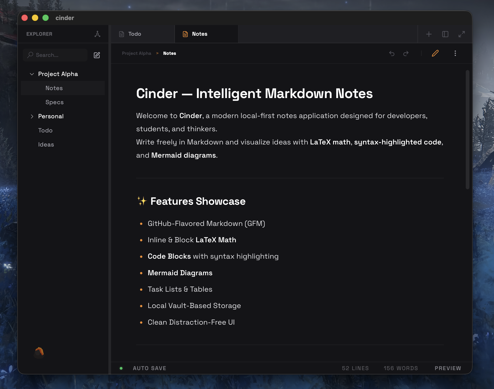

<p align="center">
  <a href="#" target="_blank"></a>
  <h1 align="center">Cinder Notes</h1>
  <div align="center">
    <a href="#" target="_blank">
      </a>
    <a href="#" target="_blank">
      </a>
    <a href="#" target="_blank">
      </a>
    <a href="#" target="_blank">
      </a>
    
    
  </div>
  <div align="center"><em>The editor for what's next. Minimal, distraction-free, and blazing fast.</em></div>
</p>

<p align="center">
    
</p>

---

## 💡 Why Cinder?

We built Cinder Notes because **no one had done it right on Tauri yet**.

There are plenty of note-taking apps out there, but most are either bloated Electron apps consuming 500MB+ of RAM, or web-based tools that feel sluggish. We wanted something different:

- **Inspired by [Zed](https://zed.dev/)** — The lightning-fast code editor that proves native performance and beautiful design can coexist.
- **Inspired by [MiaoYan](https://github.com/tw93/MiaoYan)** — A delightful Markdown note app that showed us the power of simplicity.

**Tauri** gave us the perfect foundation: native performance, lightweight bundles (a fraction of Electron's ~150MB), cross-platform support, and the security of Rust. We took that foundation and built the note-taking experience we always wanted — minimal, fast, and beautiful.

---

## ✨ Features

### Editor Experience
- **Split View Editor** — Write Markdown on the left, see a live preview on the right. Real-time sync.
- **Tab Management** — Open multiple files in tabs, close individual tabs, and switch between them seamlessly.
- **Inline Renaming** — Double-click any file or breadcrumb to rename it instantly.
- **Auto-Save** — Your changes are saved automatically as you type.
- **Breadcrumb Navigation** — Always know where you are in the file hierarchy.

### File Management
- **File Explorer** — A clean tree view for navigating your notes and folders.
- **Drag & Drop** — Reorganize files and folders by dragging them to new locations.
- **Search** — Quickly filter files in the explorer with instant search.
- **Instant File Creation** — Create new notes with a single click from the explorer or welcome page.

### Theming & UI
- **3 Built-in Themes**:
  - **Cinder Dark** — The signature dark theme with warm orange accents.
  - **Cinder Light** — A warm cream theme for daylight hours.
  - **Zen Black** — Pure pitch black for OLED displays and ultimate focus.
- **Floating Hub** — A minimal floating button for quick access to themes and settings.
- **Collapsible Sidebar** — Toggle the explorer to maximize your writing space.
- **Fullscreen Mode** — Expand the editor to fill the entire window.

### Design Philosophy
- **Distraction-Free** — The interface disappears when you don't need it.
- **Keyboard-First** — Designed for power users who prefer shortcuts.
- **Space Grotesk Typography** — Modern, geometric font for a premium feel.
- **Smooth Animations** — Subtle micro-interactions throughout the UI.

---

## 🚀 Installation & Setup

### Prerequisites
- [Node.js](https://nodejs.org/) (v18+)
- [Rust](https://www.rust-lang.org/tools/install) (for Tauri backend)

### Quick Start

```bash
# Clone the repository
git clone https://github.com/7sg56/cinder-notes.git
cd cinder-notes

# Install dependencies
npm install

# Run in development mode
npm run tauri dev
```

### Build for Production

```bash
npm run tauri build
```

Compiled binaries will be generated in `src-tauri/target/release/`.

---

## 🛠️ Tech Stack

| Layer | Technology |
|-------|------------|
| Framework | [Tauri](https://tauri.app/) — Lightweight native apps |
| Frontend | [React](https://react.dev/) + [TypeScript](https://www.typescriptlang.org/) |
| Styling | [Tailwind CSS](https://tailwindcss.com/) + CSS Variables |
| State | [Zustand](https://github.com/pmndrs/zustand) — Minimal state management |
| Icons | [Lucide](https://lucide.dev/) + [React Icons](https://react-icons.github.io/react-icons/) |
| Markdown | Custom renderer with KaTeX for math support |

**Why Tauri over Electron?**  
Tauri apps are significantly smaller (~10-20MB vs ~150MB), use less memory, and leverage the OS's native webview. The Rust backend ensures security and performance.

---

## 🗺️ Roadmap

We're currently in **active development**. Here's what's next:

### In Progress
- [ ] File system persistence via Tauri FS APIs
- [ ] Keyboard shortcuts (Ctrl+N, Ctrl+S, etc.)
- [ ] Command palette

### Planned
- [ ] Full-text search across all notes
- [ ] Note linking and backlinks
- [ ] Export to PDF/HTML
- [ ] End-to-end encryption
- [ ] Plugin system

### Timeline
- **v0.1 Alpha** — February 2026
- **v1.0 Stable** — Q2 2026

---

## 🤝 Contributing

We welcome contributions! See [CONTRIBUTING.md](CONTRIBUTING.md) for guidelines.

1. Fork the repository
2. Create a feature branch (`git checkout -b feature/amazing-feature`)
3. Commit your changes (`git commit -m 'Add amazing feature'`)
4. Push to the branch (`git push origin feature/amazing-feature`)
5. Open a Pull Request

---

## 📄 License

MIT License — see [LICENSE](LICENSE) for details.

---

## 🙏 Acknowledgments

- [Tauri](https://tauri.app/) — The framework powering the minimal footprint
- [Lucide Icons](https://lucide.dev/) — Beautiful, consistent iconography
- [Zustand](https://github.com/pmndrs/zustand) — Dead simple state management
- [Space Grotesk](https://fonts.google.com/specimen/Space+Grotesk) — The typeface that defines Cinder

---

<p align="center">
  <sub>Built with 🔥 by <a href="https://github.com/7sg56">@7sg56</a></sub>
</p>
